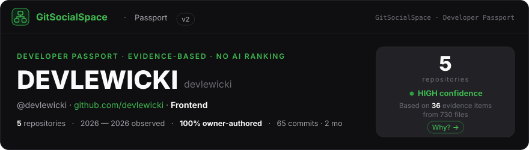
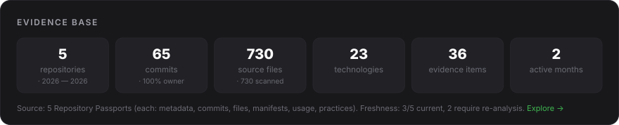
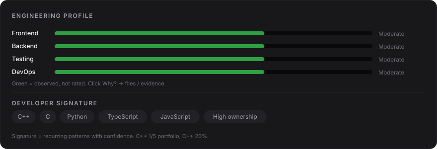
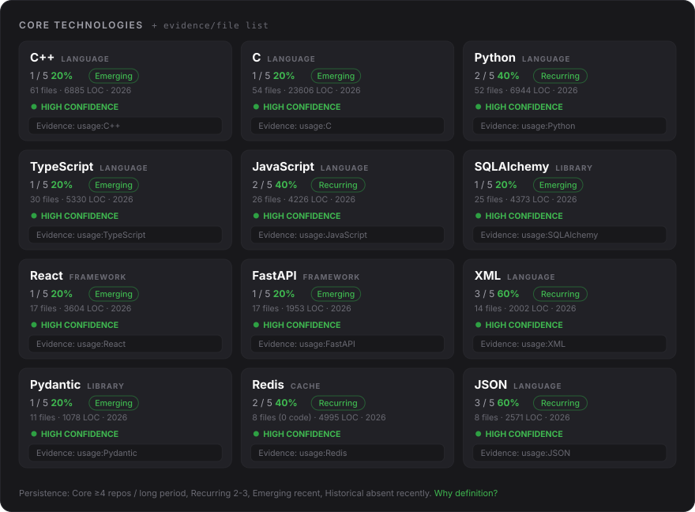
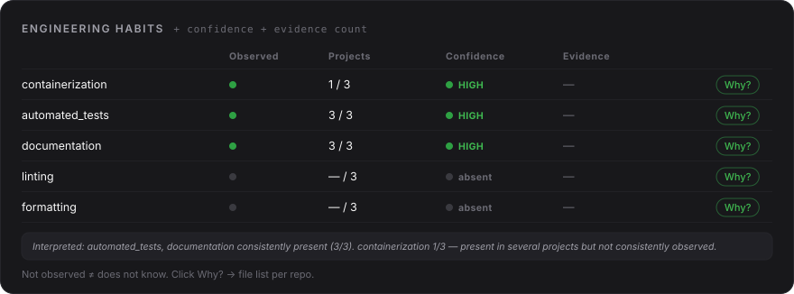
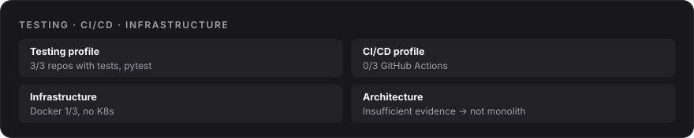
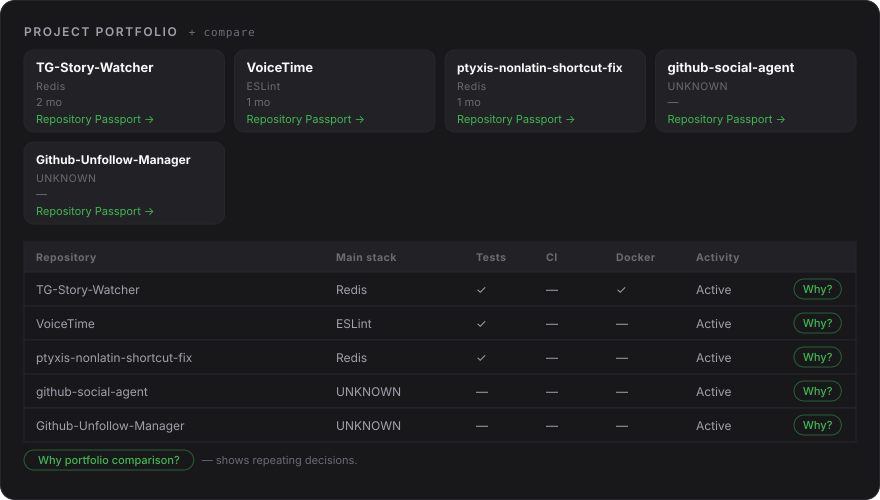
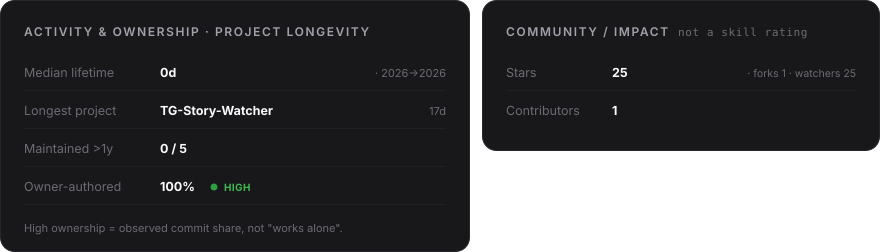

Repositories:
<a href="https://github.com/devlewicki/TG-Story-Watcher">TG-Story-Watcher</a> · 
<a href="https://github.com/devlewicki/VoiceTime">VoiceTime</a> · 
<a href="https://github.com/devlewicki/ptyxis-nonlatin-shortcut-fix">ptyxis-nonlatin-shortcut-fix</a> · 
<a href="https://github.com/devlewicki/github-social-agent">github-social-agent</a> · 
<a href="https://github.com/devlewicki/Github-Unfollow-Manager">Github-Unfollow-Manager</a>

